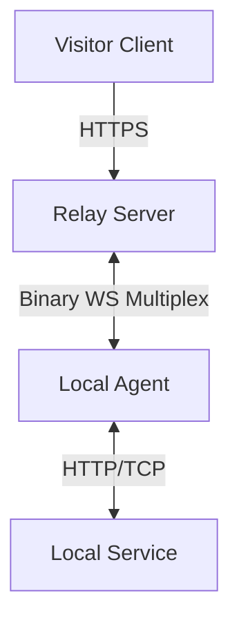

# ZARA: Multi-Protocol Tunneling

ZARA is a fast and secure multi-protocol tunneling system built for [Bun](https://bun.sh). It allows you to expose local HTTP and TCP services to the internet through a secure binary relay.

---

## 📦 Features

- **Interactive TUI**: A clean terminal dashboard with keyboard navigation and request replay.
- **CORS Support**: Simple CORS bypass (`--cors`) for local frontend development.
- **Multi-Protocol Support**: Tunnel HTTP services, static folders, or generic TCP (DBs, SSH).
- **Security**: 
  - **Self-Signed TLS**: Automatic certificate provisioning for secure local connections.
  - **Identity Verification (OTP)**: Protect your links with a professional OTP portal.
  - **Relay Authentication**: Secure your relay with shared authentication tokens.
- **Load Balancing**: Connect multiple agents to one ID for automatic round-robin distribution.
- **Protocol Compression**: Automatic Gzip compression for efficient data transfer.

---

## ⚡ Quick Install

ZARA is optimized for [Bun](https://bun.sh). Install it globally:

```bash
bun install -g @f0rsak3n1598/zara-tunnel
```

---

## 🚀 Usage

### 1. Expose a Local Web Service
```bash
# Expose port 3000 with a custom name and OTP protection
zara expose 3000 --name my-app --otp
```

### 2. Expose a TCP Service (DB, SSH, etc.)
```bash
zara tcp 5432 --name local-db
```

### 3. Share a Static Directory
```bash
zara share ./dist --name my-site
```

### 4. Start your own Relay (Self-Hosted)
```bash
# Start a relay with a secret token and custom RPS limit
zara relay --token my-secret-token --max-rps 300
```

---

## 🛠️ Advanced Options

- `--name <subdomain>`: Request a specific subdomain (e.g., `my-sub.zara.dev`).
- `--token <secret>`: Authenticate with a secured relay server.
- `--otp`: Enable one-time password protection for web tunnels.
- `--cors`: Enable automatic CORS bypass headers.
- `--relay <url>`: Connect to a custom ZARA relay (default: `wss://localhost:6969/_ws`).
- `--debugPort <number>`: Custom port for the debugger UI (default: 4040).

### Relay Server Options
- `--port <number>`: Port to listen on (default: 6969).
- `--token <secret>`: Shared secret for agent authentication.
- `--max-rps <number>`: Rate limit per agent connection (default: 150).
- `--max-otp <number>`: Max failed OTP attempts before lockout (default: 5).
- `--brand <name>`: Custom brand name for the UI.
- `--theme <dark|light>`: UI theme color scheme.
- `--key <path>`, `--cert <path>`: Custom SSL certificate files.

---

## 🧩 Local Middleware (`zara.config.ts`)

ZARA supports local middleware that allows you to intercept and modify traffic directly on your machine. Create a `zara.config.ts` in your project folder:

```typescript
export default {
  // Modify incoming requests before they reach your local server
  async onRequest(req) {
    req.headers['x-zara-custom'] = 'true';
    return req;
  },
  // Modify outgoing responses before they are sent back to the relay
  async onResponse({ status, headers, body }) {
    headers['x-powered-by'] = 'ZARA';
    return { status, headers, body };
  }
};
```

---

## 🐳 Docker

ZARA is container-ready. Use our high-performance images:

```bash
# Run the entire stack via Docker Compose
docker-compose up --build
```

---

## 🧱 Technical Architecture

ZARA uses a high-concurrency binary multiplexing protocol built on WebSockets.



### Tech Stack
- **Runtime**: [Bun](https://bun.sh)
- **Encryption**: Automatic 4096-bit Certs
- **Compression**: Native Gzip
- **Protocol**: Custom Binary Framing

---

## 💻 Development & Open Source

Contributions are welcome!

```bash
git clone https://github.com/f0rsakeN-afk/zara-tunnel.git
cd zara-tunnel
bun install
bun run build
```

**License**: MIT
